# *Parkinson_disease_severity_prediction*

## Table of Contents
1. [Introduction](#)
2. [Related Work](#)
3. [Data Exploration](#)
4. [Data Cleaning](#)
5. [Feature Normalization](#)
6. [Feature Selection](#)
7. [Model Training](#)
8. [Model Selection and Hyper Parameter Tuning](#)
9. [Results and Conclusion](#)

### Introduction
Parkinson Disease (PD) is the second most common neurodegenerative disease after Alzheimer's disease. Population prevalence of PD increases from about 1% at age 60 to 4% by age 80. Parkinson's disease (PD) is a type of movement and non-movement disorder. 

It happens when nerve cells in the brain don't produce enough of a brain chemical called dopamine. There is no specific test for PD, so it can be difficult to diagnose. Doctors use a medical history and a neurological examination to diagnose it. Early symptoms of PD include tremor, rigidity, and difficulty walking; cognitive decline is common at later stages. It is more common in men than in women. Vocal impairment is also common with studies reporting 70% - 90% prevalence after the disease onset. Early and accurate diagnosis of PD is critical for effective treatment, but unfortunately PD diagnosis is not efficient. 

Tracking Parkinson's disease (PD) symptom progression often uses the unified Parkinson's disease rating scale (UPDRS) that requires the patient's presence in clinic, and time-consuming physical examinations by trained medical staff. UPDRS consists of 3 sections. 1)  Mentation, Behavior and Mood; 2) Activities of Daily Living; 3) Motor. Motor UPDRS score ranges from 0-108 and Total UPDRS score range from 0-176.

Telemonitoring of Parkinson Disease is non-invasive and potentially reliable, cost-effective screening of persons with PD while removing the burden of frequent visits to clinic for both the patients and health care provider. Telemonitoring of PD heavily depends on recording of speech signals and can be easily integrated into telemedicine applications. 

### Related Work
Authors of Non-invasive telemonitoring of Parkinson’s disease, Tsanas et al.[[1]](#reference) selected the most parsimonious model with a feature selection algorithm using Lasso, and statistically map the selected subset of features to UPDRS using linear and nonlinear regression techniques, which include classical least squares and non-parametric classification and regression trees (CART). Mean Absolute Error metric is used for evaluation of model and authors were able to achieve best MAE of 5.8 for Motor UPDRS and 7.5 for Total UPDRS scores on test data with CART algorithm.

### Data Understanding and Experimental Setup

In this study, 42 persons with Parkinson disease (PWP) were recruited for 6-month trial using At home testing device (AHTD). The AHTD contains a docking station for measuring tremor, paddles and pegboards for assessing upper body dexterity, a high-quality microphone headset for recording patient voice signals and a USB data stick to store test data. An LCD displays instructions for taking the tests. Typical audible prompts instruct the patient to undertake tasks to measure tremor, bradykinesia, complex coordinated motor function, speech and voice. As part of a trial to test the effectiveness of the AHTD system in practice, PWP were recruited and trained to use the device. Subsequently, an AHTD was installed in their home and they performed tests on a weekly basis. 
The main aim of this study is to analyze vocal features and representing their characteristics and map these features to UPDRS using regression methods. Main assumption in this study is that vocal performance deterioration is solely due to Parkinson Disease and not any other pathology. All subjects remained un-medicated for the six-month duration of the study.

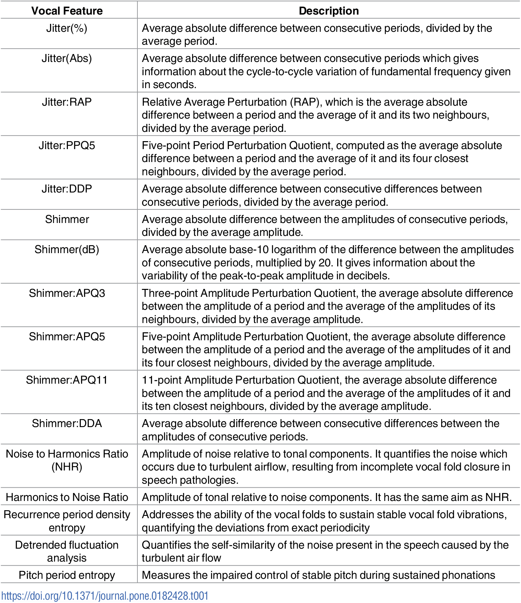

**
Features in the Dataset
**

### Data Exploration (EDA)

There are total of 5875 observations with each patient having approximately 200 recordings each.

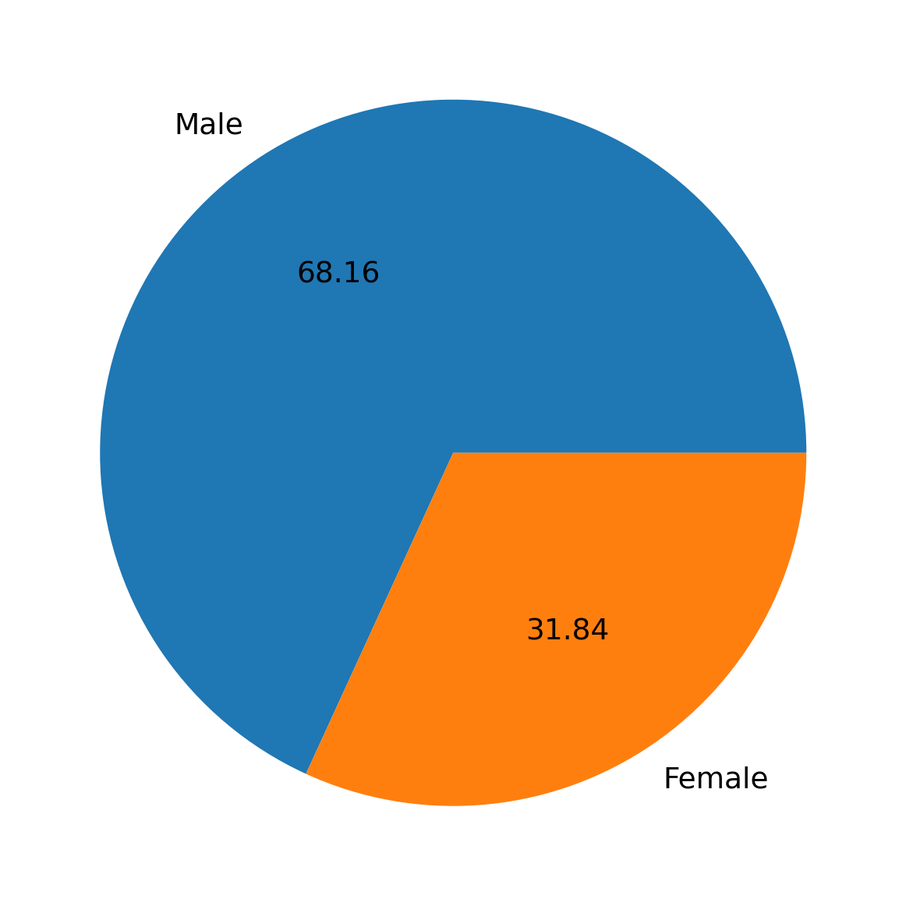

* The pie chart above describes the participants ratio. Male: 68.16% and Female: 31.84%.

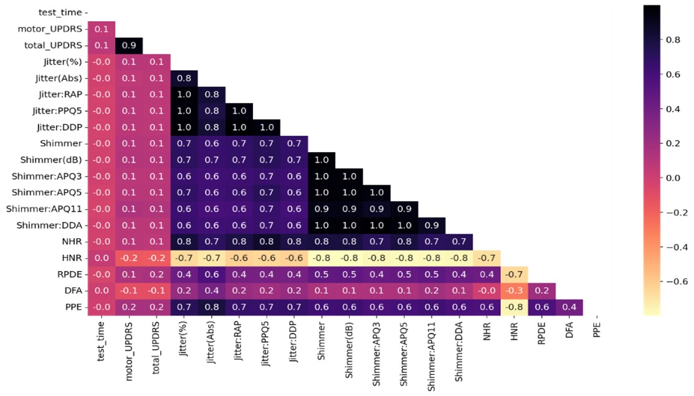

* A correlation heatmap shows the correlation between features of a data set. The plot is a matrix, where cells are correlation values between features. The color of cells represents the strength of correlation, with black indicating a strong positive correlation, yellow indicating a strong negative correlation, and purple indicating no correlation.

* Shimmer variables are correlated with each other, and Jitter is also the same. Other variables are not highly corelated except HNR which is negatively correlated with other features.

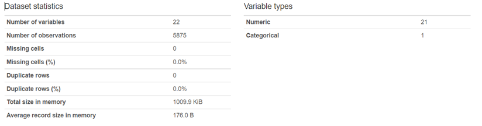

From the above figure, we can see that total number of variables are 22 where 2 variables of them are Total UPDRS and Motor UPDRS. 1 categorical variable is sex and 16 variables are voice measures and other variables are subject# and time of recording from the date of admission.

### Feature Transformation:

#### Before Feature Transformation:

#### After Feature Transformation:

### Feature Selection Mechanisms:

#### *F-Test:*

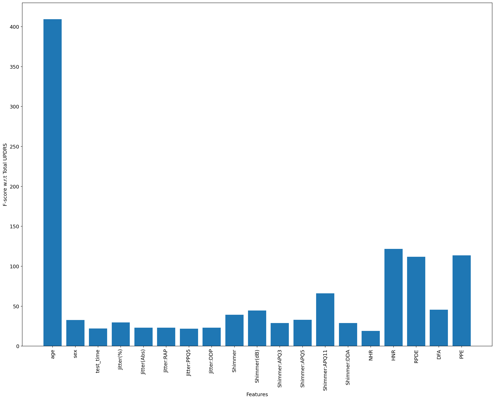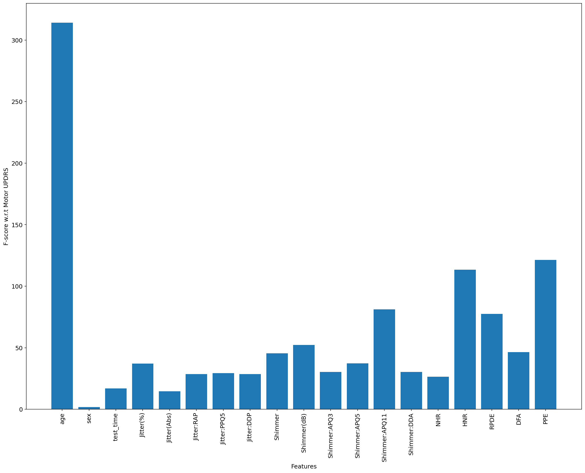

*
Fig.  F-score of features w.r.t Total and Motor UPDRS
*

#### *Mutual Information Feature Selection*:

The k best characteristics are those that result in the most mutual information. This metric is based on information theory and evaluates the reduction of uncertainty for a random variable while considering the value of another random variable that is known. In contrast to F-test, this test measures dependency of individual feature w.r.t response variable and captures complex non-linear relationship between individual feature and response variable.

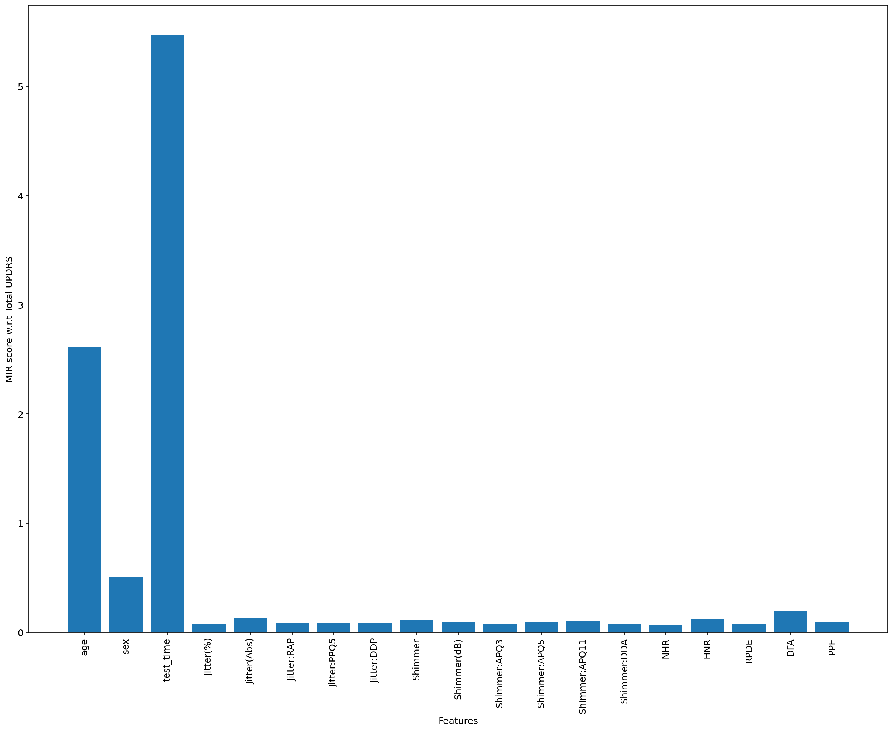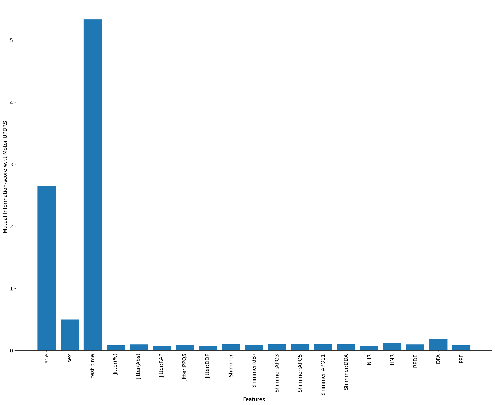

*
Fig. Mutual Information Feature Selection w.r.t Total and Motor UPRDS
*

#### Wrapper Method:

We can also use a machine learning classifier to test it repeatedly on subsets of our data set until we find which one makes the best prediction. This is a more expensive computing method, but it is more accurate than the previous ones. Recursive Feature elimination method iteratively eliminates features by ranking the features using a given ML algorithm to compute feature importance  and removes least ranked feature until the given number of features remain.

#### *Recursive Feature Elimination (RFE):*
We used the Recursive Feature Elimination (RFE) method to select the best features with 50% features selected i.e., 9 features.
Selected Features are:

a.	age\
b.	sex\
c.	test_time\
d.	Jitter(Abs)\
e.	Shimmer:APQ5\
f.	HNR\
g.	RPDE\
h.	DFA\
i.	PPE

#### Principal Component Analysis:
PCA is linear dimensionality reduction technique using singular value decomposition (SVD) of data and projects it to lower dimensional space and tries to capture the variance in original data using minimal number of variables.

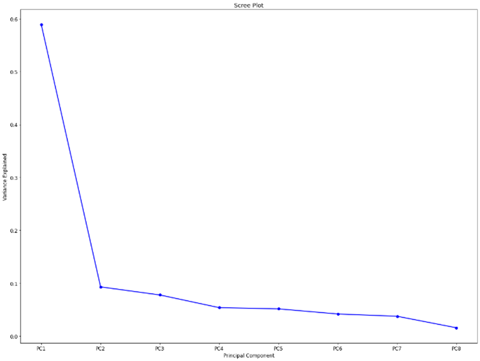
*
Fig. PCA vs Explained Variance
*

### Model Selection

#### Models Performance on Test set with Original Features

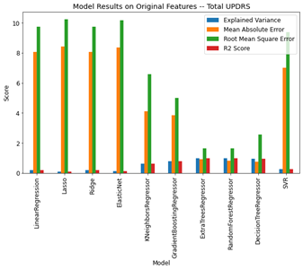

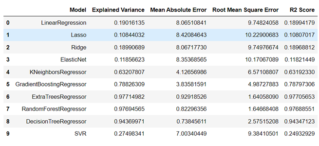

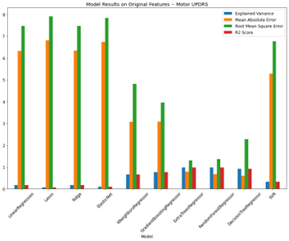

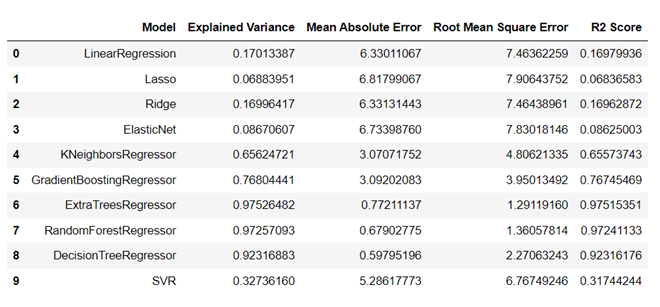

### Model Results using Selected Features from RFE

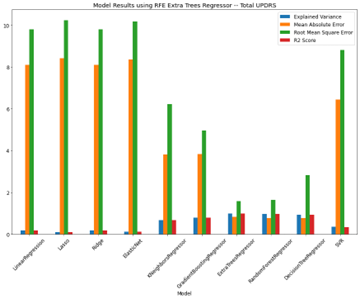

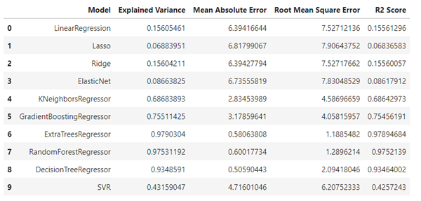

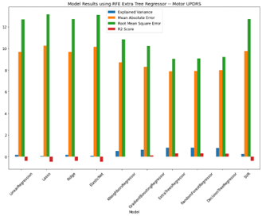

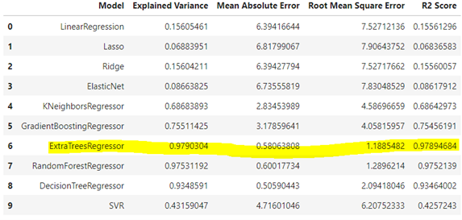

### Extra Tree Regressor Results - With Feature Selection

|Mean Absolute Error|Root Mean Square Error|R2 Score|Explained Variance|
|:----|:----|:----|:----|
|Total_UPDRS|0.743245848|1.613987611|0.977794316|0.977849405|
|Motor_UPDRS|0.604390726|1.279626524|0.975596608|0.975724054|

### Conclusion and Future work
The results support the hypothesis that the vocal features can be used to predict the UPDRS scores. The results reveal interesting insights about existing medical practices. The results show that the vocal features can be used to predict the UPDRS scores. Detecting early stage of Parkinson’s Disease would highly impact for early diagnosis which leads to address early medications for improving the quality of the patient’s life. 

The limitation was that the dataset which are used in this project was conducted on 42 patients, if there was more data collected from various kinds of patients, who were exposed to multiple diseases and also Parkinson’s Disease would give different attributes and observations. Though the UPDRS scores are linearly interpolated with the assumption of progression of disease being linear over time is not a robust assumption and may be more dynamic in practice.

<a name="reference"> Tsanas A, Little MA, McSharry PE, Ramig LO. Accurate telemonitoring of Parkinson's disease progression by noninvasive speech tests. IEEE Trans Biomed Eng. 2010 Apr;57(4):884-93. doi: 10.1109/TBME.2009.2036000. Epub 2009 Nov 20. PMID: 19932995</a>

*Please refer [project report](Parkinsons_Disease_Severity_Project_Report.pdf) for detailed report and this [Jupyter Notebook](Parkinsons_Disease.ipynb) for code.*
